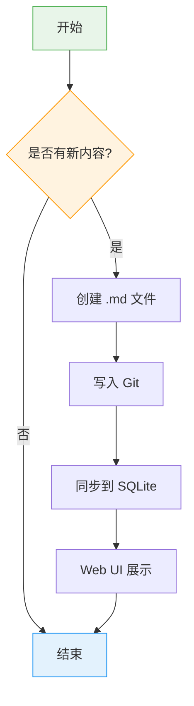
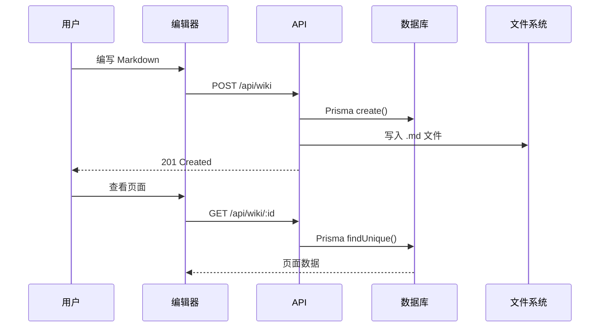

# Markdown 渲染增强演示

本页面展示了 Wiki 系统 Markdown 渲染器的全部增强功能。

## Callout 提示框

支持 GitHub 风格的 Callout 语法，通过 `> [!type]` 格式使用：

> [!note] 这是 Note 提示
> 用于一般性的补充说明，提供额外信息。

> [!tip] 这是 Tip 提示
> 用于提供有用的技巧和建议，帮助用户更好地使用系统。

> [!important] 这是 Important 提示
> 用于标记重要信息，用户不应忽略的内容。

> [!warning] 这是 Warning 提示
> 用于警告用户可能的问题或需要注意的事项。

> [!caution] 这是 Caution 提示
> 用于标记危险操作，可能导致数据丢失或系统故障。

> [!info] 这是 Info 提示
> 用于提供参考性的信息或背景说明。

## Mermaid 图表

### 流程图



### 时序图



## 交互式代码块

### HTML 代码预览

点击代码块右上角的「运行」按钮，可以在沙盒 iframe 中预览效果：

```html
<!DOCTYPE html>
<html>
<head>
  <style>
    body {
      display: flex;
      justify-content: center;
      align-items: center;
      min-height: 100vh;
      margin: 0;
      background: linear-gradient(135deg, #667eea 0%, #764ba2 100%);
      font-family: system-ui, sans-serif;
    }
    .card {
      background: white;
      border-radius: 16px;
      padding: 2rem;
      box-shadow: 0 20px 60px rgba(0,0,0,0.3);
      text-align: center;
      max-width: 400px;
    }
    h1 { color: #333; margin: 0 0 0.5rem; }
    p { color: #666; line-height: 1.6; }
    button {
      margin-top: 1rem;
      padding: 0.75rem 2rem;
      background: linear-gradient(135deg, #667eea, #764ba2);
      color: white;
      border: none;
      border-radius: 8px;
      font-size: 1rem;
      cursor: pointer;
      transition: transform 0.2s;
    }
    button:hover { transform: scale(1.05); }
  </style>
</head>
<body>
  <div class="card">
    <h1>Hello Wiki!</h1>
    <p>这是一个在 Wiki 中运行的 HTML 交互预览。</p>
    <button onclick="this.textContent='Clicked!'">Click Me</button>
  </div>
</body>
</html>
```

### JavaScript 代码预览

```javascript
// 计算斐波那契数列
function fibonacci(n) {
  const memo = [0, 1];
  for (let i = 2; i <= n; i++) {
    memo[i] = memo[i - 1] + memo[i - 2];
  }
  return memo;
}

// 输出前 20 个斐波那契数
const result = fibonacci(20);
console.log('Fibonacci:', result.join(', '));

// 在页面上展示
document.body.innerHTML = `
  <div style="padding:2rem;font-family:system-ui;">
    <h2 style="color:#333;">Fibonacci Sequence</h2>
    <div style="display:flex;flex-wrap:wrap;gap:8px;">
      ${result.map(n => `
        <span style="
          background:linear-gradient(135deg,#667eea,#764ba2);
          color:white;
          padding:8px 16px;
          border-radius:8px;
          font-weight:bold;
          font-size:${8 + n * 0.3}px;
        ">${n}</span>
      `).join('')}
    </div>
  </div>
`;
```

### 普通代码块（无运行按钮）

```python
# Python 代码 — 不支持运行预览
from dataclasses import dataclass

@dataclass
class WikiPage:
    title: str
    content: str
    page_type: str = "concept"
    tags: list[str] = None

    def __post_init__(self):
        if self.tags is None:
            self.tags = []

    def summary(self) -> str:
        return f"{self.title} ({self.page_type}): {len(self.content)} chars"
```

## 增强表格

### 技术对比

| 功能 | 基础 Markdown | 增强渲染器 |
|------|--------------|-----------|
| Callout 提示框 | 不支持 | 6 种类型 |
| Mermaid 图表 | 不支持 | 流程图/时序图等 |
| 代码运行预览 | 不支持 | HTML/JS 支持 |
| 代码高亮 | 基础 | OneDark + 行号 |
| 表格样式 | 纯文本 | 圆角边框 + 悬停高亮 |
| 图片 | 原始 | 圆角 + 阴影 + 标题 |
| 复制按钮 | 无 | 一键复制 |

### Callout 类型速查

| 语法 | 类型 | 用途 |
|------|------|------|
| `> [!note]` | Note | 一般补充说明 |
| `> [!tip]` | Tip | 有用的技巧建议 |
| `> [!important]` | Important | 重要信息 |
| `> [!warning]` | Warning | 警告注意 |
| `> [!caution]` | Caution | 危险操作 |
| `> [!info]` | Info | 参考信息 |

## 其他增强

### 引用块（非 Callout）

> 普通引用块仍然可用，不带 Callout 标记的 `>` 语法会渲染为传统的斜体引用样式。

### 分隔线

---

上下文之间可以用 `---` 分隔。

### 行内代码

支持 `行内代码` 样式，用于标记变量名、命令、文件路径等。

### 链接

- [GitHub 仓库](https://github.com/zengsipei/llm-wiki)
- [预览地址](https://zengsipei.space-z.ai/)