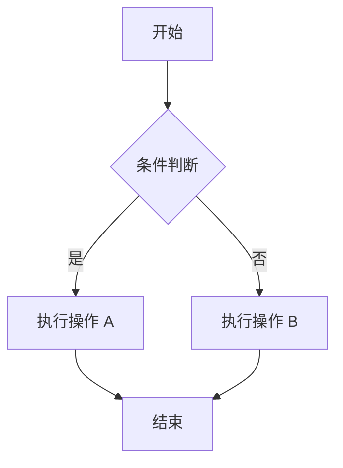
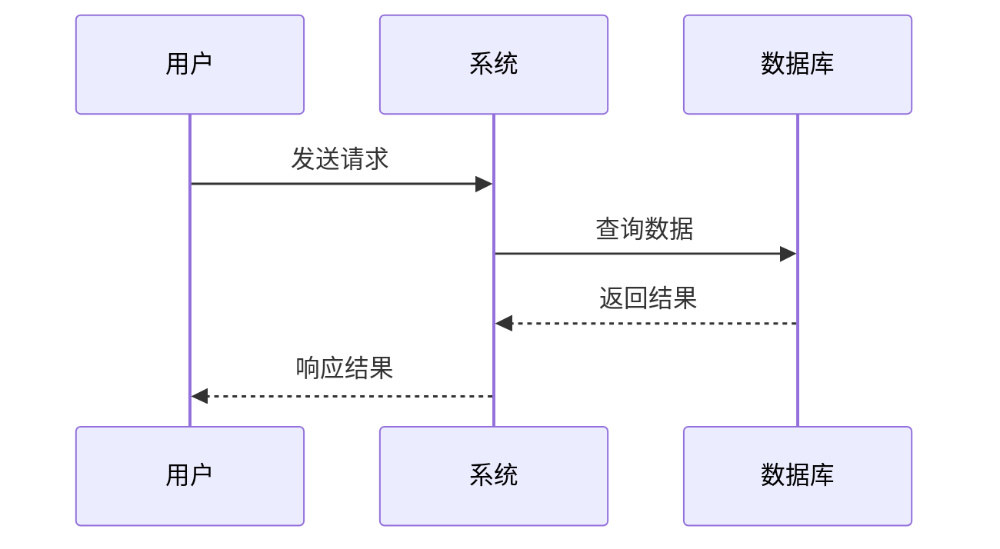

# Markdown 进阶语法

Markdown 的进阶语法和扩展功能，涵盖 GFM、Frontmatter、Callout 和 Mermaid 图表。

## 基础语法回顾

| 语法 | 效果 |
|------|------|
| `# 标题` | H1 标题 |
| `**粗体**` | **粗体** |
| `*斜体*` | *斜体* |
| `` `代码` `` | `行内代码` |
| `[链接](url)` | 可点击链接 |
| `` | 图片 |
| `> 引用` | 引用块 |

## GFM 扩展

### 表格

```markdown
| 列 1 | 列 2 | 列 3 |
|------|------|------|
| 内容 | 内容 | 内容 |
| 内容 | 内容 | 内容 |
```

### 任务列表

```markdown
- [x] 已完成的任务
- [ ] 待完成的任务
- [ ] 另一个任务
```

### 删除线

```markdown
~~这段文字被删除了~~
```

## Frontmatter

> [!note] Frontmatter 的作用
> Frontmatter 是 Markdown 文件顶部的 YAML 元数据，用于存储标题、标签、日期等结构化信息。

```yaml
---
title: 文章标题
type: concept
tags:
  - AI
  - Markdown
  - 写作
created: 2026-01-15
updated: 2026-05-22
author: zengsipei
---
```

## Callout 提示框

> [!tip] 提示
> 用于给出有用的建议和技巧。

> [!warning] 警告
> 提醒用户注意潜在的问题。

> [!important] 重要
> 标记不可忽略的关键信息。

> [!caution] 注意
> 标记可能导致数据丢失的操作。

> [!note] 备注
> 提供补充说明信息。

## Mermaid 图表

### 流程图

````markdown

````

### 时序图

````markdown

````

## 数学公式（部分渲染器支持）

```markdown
行内公式：$E = mc^2$

块级公式：
$$
\sum_{i=1}^{n} x_i = x_1 + x_2 + \cdots + x_n
$$
```

## 写作建议

1. **标题层级**：H1 只用一次（文章标题），H2 用于主要章节
2. **段落长度**：每段 3-5 句话，避免过长的段落
3. **列表使用**：超过 3 个并列项时用列表而非逗号分隔
4. **代码标注**：代码块始终标注语言 ` ```python `
5. **图片 Alt**：图片始终提供 alt 文本