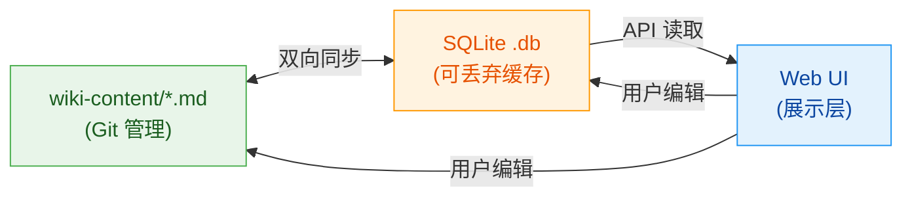
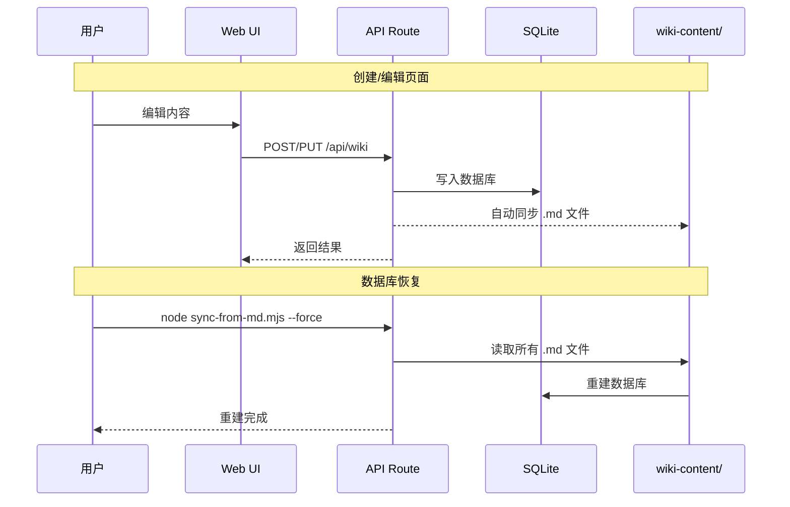

# 知识库架构设计

本文档描述了 LLM Wiki 项目的架构设计决策和演进历程。

## 设计理念

### md 做记忆，html 做展示

这是项目的核心架构理念，灵感来自「HTML 的不合理有效性」研究：

- **内容层**：Markdown 文件（Git 管理）作为内容的 source of truth
- **展示层**：渲染引擎将 Markdown 转化为富交互 HTML
- **索引层**：SQLite 数据库作为可丢弃的搜索缓存



### 为什么选择这个架构

> [!warning] 教训：数据库丢失事件
> 2026-05-22 凌晨，一次 cron 定时任务意外运行了种子脚本，导致数据库被重置，25 个手工创建的页面全部丢失。由于 *.db 在 .gitignore 中，Git 中没有历史记录，无法恢复。
> 
> 这一事件直接催生了当前架构的重新设计。

传统的 Wiki 系统将所有内容存储在数据库中，存在以下问题：

1. **数据丢失风险**：数据库损坏或被重置，内容无法恢复
2. **不可 diff**：二进制数据库无法用 Git 追踪内容变更
3. **锁定在系统中**：内容无法用普通编辑器编辑，无法做 PR Review

通过将 .md 文件作为 source of truth，我们获得：

> [!tip] 核心优势
> - Git 版本历史，随时回溯任何变更
> - 内容可读、可 diff、可分支
> - 数据库丢失后可从 .md 文件一键重建
> - 本地用任何编辑器都能编辑内容

## 技术栈

### 后端

| 组件 | 技术 | 说明 |
|------|------|------|
| 框架 | Next.js 16 | App Router，API Routes |
| 数据库 | SQLite + Prisma ORM | 轻量级，无需外部服务 |
| AI SDK | z-ai-web-dev-sdk | 平台内置，支持 GLM 模型 |
| 图表 | Mermaid 11 | 流程图/时序图渲染 |
| 进程管理 | PM2 | 持久化、自动重启 |
| 反向代理 | Caddy | HTTPS + 静态文件服务 |

### 前端

| 组件 | 技术 | 说明 |
|------|------|------|
| UI 框架 | React 19 | 客户端 SPA 架构 |
| 组件库 | shadcn/ui | new-york 风格，可定制 |
| Markdown | react-markdown + remark-gfm | GFM 表格 + Callout + Mermaid |
| 代码高亮 | react-syntax-highlighter | oneDark 主题，支持运行预览 |
| 样式 | Tailwind CSS 4 | 亮/暗模式支持 |

### 文件结构

```
llm-wiki/
├── wiki-content/          # Wiki 页面源文件（Git 管理）
│   ├── *.md               # Markdown 文件 + YAML frontmatter
│   └── README.md
├── public/
│   └── html-effectiveness-demos/  # 交互式 Demo
├── src/
│   ├── app/               # Next.js App Router
│   │   ├── api/wiki/      # Wiki API 路由
│   │   └── html-effectiveness/  # Demo 画廊页面
│   ├── components/        # React 组件
│   │   └── wiki/          # Wiki 专用组件
│   │       ├── markdown-renderer.tsx  # 增强 Markdown 渲染器
│   │       └── views/      # 页面视图组件
│   └── lib/               # 工具函数
├── scripts/
│   ├── seed-example.mjs   # 示例数据种子
│   ├── sync-from-md.mjs   # .md → 数据库重建脚本
│   └── sync-to-md.mjs     # 数据库 → .md 导出脚本
├── docs/                  # 项目文档
└── prisma/
    └── schema.prisma      # 数据库模型定义
```

## 数据流架构



## 数据模型

### WikiPage

核心内容模型，存储每个 Wiki 页面：

- `title`: 页面标题
- `content`: Markdown 正文
- `pageType`: 类型（entity/concept/summary）
- `tags`: JSON 数组标签
- `backlinks`: JSON 数组反向链接
- `sourceId`: 可选的来源文档关联

### Source

原始文档来源记录：

- `title`: 文档标题
- `content`: 原始文本
- `sourceType`: 来源类型（manual/file/web）
- `status`: 处理状态（pending/processed）

### ActivityLog

操作日志，记录所有变更：

- `actionType`: 操作类型（ingest/query/lint/edit/create/delete）
- `summary`: 操作摘要
- `relatedPages`: 关联页面 ID 数组

## API 路由

| 路由 | 方法 | 功能 |
|------|------|------|
| `/api/wiki` | GET/POST | 列表/创建页面 |
| `/api/wiki/[id]` | GET/PUT/DELETE | 读取/更新/删除页面 |
| `/api/wiki/ingest` | POST | AI 文档摄入 |
| `/api/wiki/query` | POST | AI 知识问答 |
| `/api/wiki/lint` | POST | AI 健康检查 |
| `/api/wiki/search` | GET | 全文搜索 |
| `/api/wiki/logs` | GET | 操作日志 |
| `/api/wiki/export` | GET | 导出（Markdown ZIP/JSON 图谱） |

## 展示层增强

> [!note] Markdown 渲染器特性
> 当前 MarkdownRenderer 支持以下增强功能：
> - Callout 语法：`> [!note]`、`> [!tip]`、`> [!warning]`、`> [!important]`、`> [!caution]`
> - Mermaid 图表：通过 ` ```mermaid ` 代码块渲染流程图、时序图等
> - 交互式代码块：HTML/JS 代码支持一键运行预览（iframe sandbox）
> - 增强表格：圆角边框、悬停高亮、响应式滚动
> - 代码高亮：OneDark 主题，自动行号，复制按钮

## 数据同步机制

### DB → .md（自动）

每次通过 API 创建、更新或删除页面时，自动同步对应的 .md 文件到 `wiki-content/` 目录。这是 fire-and-forget 的，不影响 API 响应。

> [!important] 单向写入
> .md 文件只能通过 API 路由（经 DB 中转）修改。直接编辑 .md 文件后需手动运行 sync-from-md.mjs 同步到 DB。

### .md → DB（手动）

当数据库丢失或需要重建时，运行：

```bash
node scripts/sync-from-md.mjs          # 增量同步
node scripts/sync-from-md.mjs --force  # 清空后全量重建
```

> [!caution] --force 模式
> 使用 --force 会清空所有 WikiPage、ActivityLog 和 Source 记录后再重建。操作前请确保 wiki-content/ 目录中的文件是最新的。

## 部署

- GitHub 仓库：https://github.com/zengsipei/llm-wiki
- 预览地址：https://zengsipei.space-z.ai/
- 进程管理：PM2（wiki 进程，端口 3000）
- Caddy 反向代理：:81 → :3000
